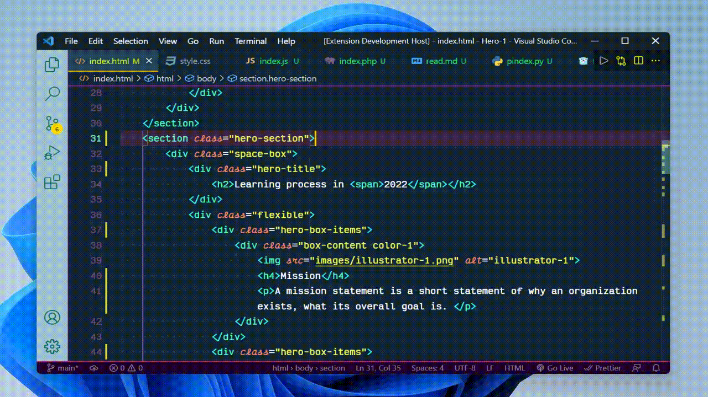
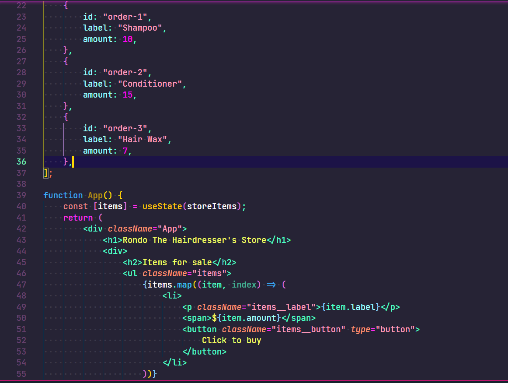
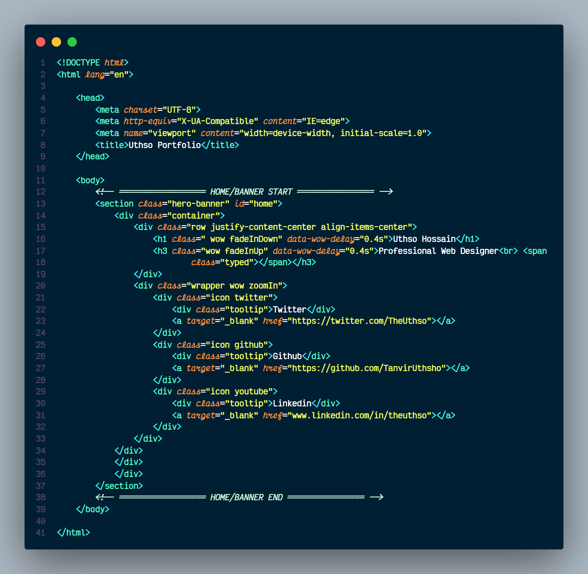
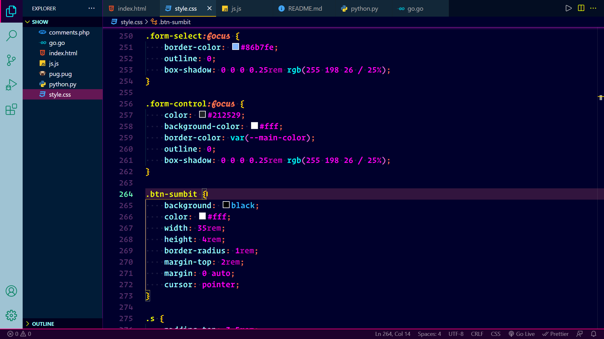
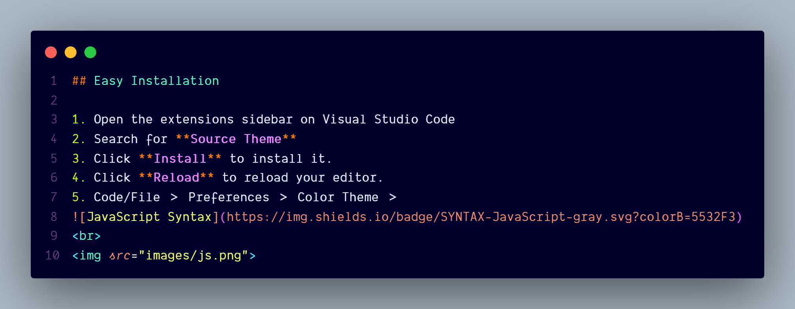
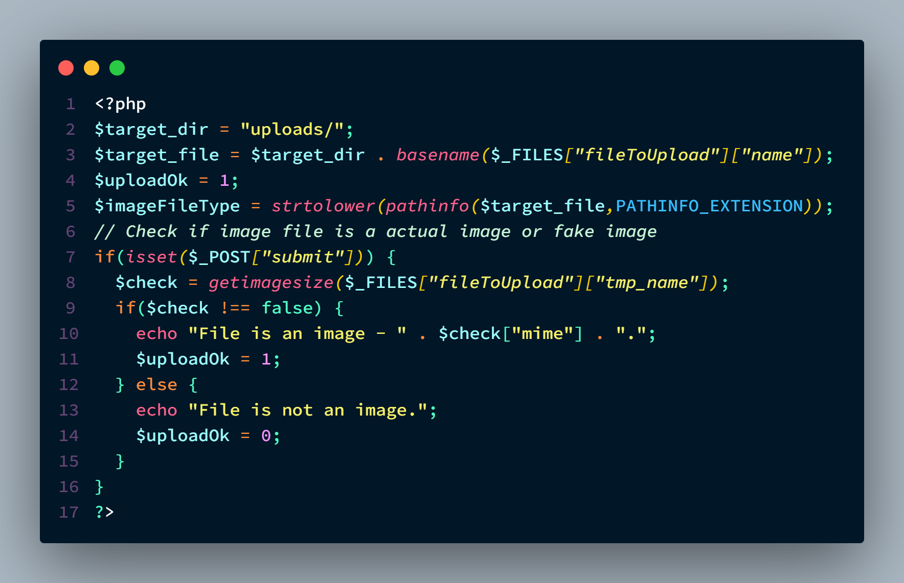
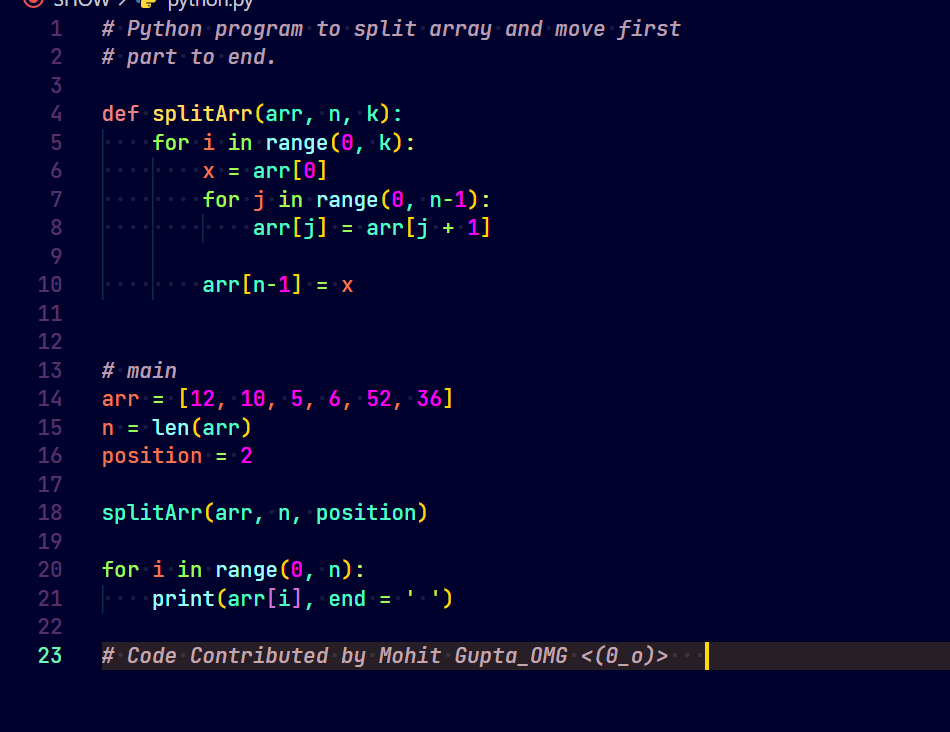
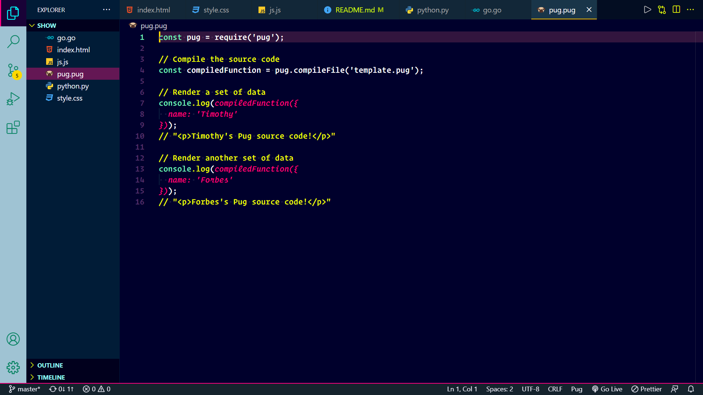

<div align="center">
<a align="center" href="https:// "></a>

<br>
<br>

# Source Theme for VS Code

<a href="https://marketplace.visualstudio.com/items?itemName=THUthsho.source-theme#review-details"></a> <a href="https://marketplace.visualstudio.com/items?itemName=THUthsho.source-theme"></a> <br>

<p align="center">
 <a href="https://"></a>

<br><h3>To Conatct me:</h3>
<a href="theuthso.com"><h3>theuthso@gmail.com<h3></a>

</p>

</div>

<br>

<table width='100%' align="center">
    <tr>
        <td align='left' width='100%' colspan='2'>
            <strong><code>Source Theme</code></strong><br><br>
            <div align="center">

> _Theme your code editor will love_

</div><br<br>
            A professional theme with hand-picked & bold colorful for your VS Code editor and terminal. I have created this theme in combination with other good themes in the marketplace. I think this theme is the best and unique among the best themes in Marketplace.<br>
        </td>
    </tr>
    <tr><td><sup> Follow Uthsho's on GitHub <a href='https://github.com/TanvirUthsho'>@TanvirUthsho</a>
     —   Say Hi on Twitter <a href="https://twitter.com/TheUthso">@TheUthso</a></sup></td><td  align='center'> <a  target="_blank" href='https://twitter.com/TheUthso'>👋 </a>
     </td></tr>
</table>

<div align="center">

[](https://github.com/TanvirUthsho/source-theme-vscode/stargazers) [](https://github.com/TanvirUthsho?tab=followers) [](https://twitter.com/TheUthso)

</div>

<br>
<br>


## Easy Installation

1. Open the extensions sidebar on Visual Studio Code
2. Search for **Source Theme**
3. Click **Install** to install it.
4. Click **Reload** to reload your editor.
5. Code/File ＞ Preferences ＞ Color Theme ＞ **Source Theme**.
6. 🌟 [Rate five-stars](https://marketplace.visualstudio.com/items?itemName=THUthsho.source-theme&ssr=false#review-details) like 110+ awesome devs to appreciate the effort behind this theme.

<br>


## Alternate Installation

1. Launch Quick Open using <kbd>Cmd</kbd>+<kbd>P</kbd> — or — <kbd>Ctrl</kbd>+<kbd>P</kbd>.
2. Paste the command `ext install source-theme`
3. Click **Install** to install it.
4. Click **Reload** to reload the your editor.
5. Code/File ＞ Preferences ＞ Color Theme ＞ **Source theme**.
6. 🌟 [Rate five-stars](https://marketplace.visualstudio.com/items?itemName=THUthsho.source-theme&ssr=false#review-details) like 110+ awesome devs to appreciate the effort on this theme.

<br>

## Screenshots: Source Theme


<div align="center">

<br>


<br>


<br>


<br>
<br>
<br>




<br>


<br><br><br>




<br>


<br><br><br>



<br>


<br>
<br>
<br>


<br>


<br>


<br><br>



<br><br>


<!-- <br><br> -->

<!-- 


<br>
 -->

<br><br>


</div>
<br>


## Best Custom Settings

This theme works best with the following settings. Especially if you have the Operator mono/Victor mono font. Add it to your user settings JSON object.

```json
{
    "workbench.colorTheme": "Source Theme",
    // The Cursive font is Victor Mono.It's Free and awsome :-)
    "editor.fontFamily":"Victor Mono"
     // OR
    // But The almst same font Operator Mono. It's $200 and you need to buy it.
    // "editor.fontFamily": "Operator Mono, Menlo, Monaco, 'Courier New', monospace",
    "editor.fontSize": 15,
    "editor.lineHeight": 25,
    "editor.letterSpacing": 0.5,
    "files.trimTrailingWhitespace": true,
    "editor.fontWeight": "400",
    "prettier.eslintIntegration": true,
    "editor.cursorStyle": "line",
    "editor.cursorWidth": 5,
    "editor.cursorBlinking": "solid",
    "editor.renderWhitespace": "all"
}
```

<br>


## Frequently Asked Questions

-   👌 [Source Theme VSCode Theme With Italic Mixed](https://github.com/TanvirUthsho/source-theme-vscode)

<br>


## Put `Source Theme` In VS Code

-   🔥 [VSCode theme](https://github.com/TanvirUthsho/source-theme-vscode) — Source Theme
    <br>
    <br>
    <br>


#### **Hello, I am a [Engineer](https://TheDevCouple.com)**!

I am [Tanvir Hossain Uthsho](https://twitter.com/t.h.uthsho/).
Uthsho means Source. That's why I named My theme Source Theme. I am a Full Stack Web/JS Developer, OSS Dev Advocate, and a core developer at WordPress. This Is my Personal Website:<a href= "WWW.theuthso.com"> theuthso.com</a>

<!-- > #### [**Support our Open Source Projects!**](https://pay.paddle.com/checkout/515568)
> If you'd like us to keep producing professional free and open source software (FOSS). Consider [paying for an hour of my dev-time](https://pay.paddle.com/checkout/515568). We'll spend two hours on open source for each contribution. Yeah, that's right, you pay for one hour and get both of us to spend an hour as a thank you. [Support here →](https://pay.paddle.com/checkout/515568) -->

<br>


## License & Attribution

**Licensed** as Apache ⓒ [Uthsho Hossian](https://uthshohossain.com/).

Thanks to VSCode team at Microsoft for creating such an awesome code editor. Also to the creator of other high contrast themes that served as an inspiration. This theme takes inspiration from many VSCode themes including but not limited to Cobalt themes by Wes Bos, JellyFish, Shades of Purple,
Zeonica, Synthwave 84 etc.<br>


<div align="center">
_👋 Follow Me_<br><br>

[](https://twitter.com/TheUthso)
[](https://www.facebook.com/profile.php?id=100045095227196)
[](https://www.linkedin.com/in/theuthso)

</div>

<br>
<br>
<br>


